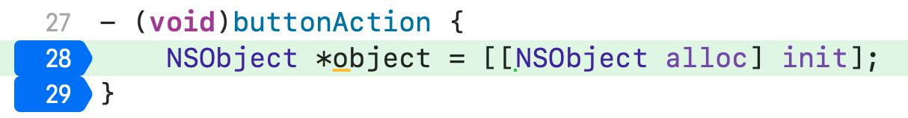

`HMLLDB` is a collection of LLDB commands to assist in the debugging of iOS apps.  
[中文介绍](https://juejin.cn/post/6922784750986297352)

## Features
- Non-intrusive. Your iOS project does not need to be modified
- All commands support real device and simulator
- All commands support Objective-C and Swift project
- Some commands provide interactive UI within the APP

## Requirements
- Xcode 14.3.1
- 64-bit simulator or real device, iOS 11.0+
- Some commands require debug configuration (or ***Optimization Level*** set [-O0]/[-Onone])

## Installation
1. Download all the files. I recommend you to clone the repository.
2. Open  (or create) `~/.lldbinit` file, and append the following lines to the end of the file: 
```
command script import /path/to/HMLLDB.py
```
For example, this is the command in my computer:   
`command script import /Users/pal/Desktop/gitProjects/HMLLDB/commands/HMLLDB.py`

3. Restart Xcode, run your own iOS project, click `Pause program execution` to enter the LLDB debugging mode, enter the command `help`, if you see the commands described below, the installation is successful.

## Commands

| Command        | Description            |
| -------------- | ---------------------- |
| autodsym       | Add a debug symbol file to the target's modules automatically |
| deletefile     | Delete the specified file in the sandbox |
| pbundlepath    | Print the path of the main bundle |
| phomedirectory | Print the path of the home directory("~") |
| fclass         | Find the class containing the input name(Case insensitive) |
| fsubclass      | Find the subclass of the input |
| fsuperclass    | Find the superclass of the input |
| fmethod        | Find the specified method in the method list, you can also find the method list of the specified class |
| methods        | Execute `[inputClass _methodDescription]` or `[inputClass _shortMethodDescription]` |
| properties     | Execute `[inputClass _propertyDescription]` |
| ivars          | Execute `[instance _ivarDescription]` |
| ivarsinfo | Show ivars information of class |
| bpframe        | Set a breakpoint that stops only when the specified stack keyword is matched |
| bpmessage      | Set a breakpoint for a selector on a class, even if the class itself doesn't override that selector |
| bpmethod       | Set a breakpoint that stops when the next OC method is called(via objc_msgSend) in the current thread |
| rc             | Show general purpose registers changes |
| rr             | Alias for 'register read' with additional -s/--sp arguments |
| adrp           | Get the execution result of the adrp instruction |
| tracefunction  | Trace functions step by step until the next breakpoint is hit |
| traceinstruction | Trace instructions step by step until the next breakpoint is hit |
| trace-step-over-instruction | Trace step over instruction |
| pfont          | Print all font names supported by the device |
| plifecycle     | Print life cycle of UIViewController |
| redirect       | Redirect stdout/stderr |
| push           | Find UINavigationController in keyWindow then push a specified UIViewController |
| showhud        | Display the debug HUD on the key window. It shows the memory usage, CPU utilization and FPS of the main thread |
| sandbox        | Present a sandbox browser that can share and delete files |
| inspect        | Inspect UIView |
| request        | Print http/https request automatically |
| environment    | Show diagnostic environment. |
| ...            |                        |

All commands in the table can use `help <command>` to view the syntax and examples. For example, the output of `help fmethod`:
```
(lldb) help fmethod
     Find the method.  Expects 'raw' input (see 'help raw-input'.)

Syntax: fmethod

    Syntax:
        fmethod <methodName>  (Case insensitive.)
        fmethod [--class] <className>

    Options:
        --class/-c; Find all method in the class

    Examples:
        (lldb) fmethod viewdid
        (lldb) fmethod viewDidLayoutSubviews
        (lldb) fmethod -c UITableViewController

    This command is implemented in HMClassInfoCommands.py
```

## Example
Some examples use the demo in the [Kingfisher](https://github.com/onevcat/Kingfisher) project.  
**It is recommended to click `Pause program execution` to enter the LLDB debugging mode to execute commands, instead of executing commands by hitting breakpoints.**

### autodsym
The `target symbols add [<symfile>]` command needs to specify the address of the symbol, and the `autodsym` command allows you to omit the parameter.    
```
# The following two commands have the same effect
(lldb) autodsym
(lldb) target symbol add /path/to/dSYM
```


### deletefile
It is recommended to re-run the application after executing the command, because some data is still in the memory.
```
# Delete all file in the sandbox
(lldb) deletefile -a

# Delete the "~/Documents" directory
(lldb) deletefile -d

# Delete the "~/Library" directory
(lldb) deletefile -l

# Delete the "~/tmp" directory
(lldb) deletefile -t

# Delete the "~/Library/Caches" directory
(lldb) deletefile -c

# Delete the "~Library/Preferences" directory
(lldb) deletefile -p

# Delete the specified file or directory
(lldb) deletefile -f path/to/fileOrDirectory
```

### pbundlepath & phomedirectory
```
# Print the path of the main bundle
(lldb) pbundlepath
[HMLLDB] /Users/pal/Library/Developer/CoreSimulator/Devices/D90D74C6-DBDF-4976-8BEF-E7BA549F8A89/data/Containers/Bundle/Application/84AE808C-6703-488D-86A2-C90004434D3A/Kingfisher-Demo.app

# Print the path of the home directory
(lldb) phomedirectory
[HMLLDB] /Users/pal/Library/Developer/CoreSimulator/Devices/D90D74C6-DBDF-4976-8BEF-E7BA549F8A89/data/Containers/Data/Application/3F3DF0CD-7B57-4E69-9F15-EB4CCA7C4DD8

# If it is running on the simulator, you can add the -o option to open path with Finder
(lldb) pbundlepath -o
(lldb) phomedirectory -o
```

### fclass & fsubclass & fsuperclass & fmethod
These commands are optimized for Swift, and the namespace can be omitted when entering the Swift class.   

`fclass`: Find all class names that contain the specified string.

```
(lldb) fclass NormalLoadingViewController
[HMLLDB] Waiting...
[HMLLDB] Count: 1
Kingfisher_Demo.NormalLoadingViewController (0x102148fa8, Kingfisher-Demo)

# Case insensitive
(lldb) fclass image
[HMLLDB] Waiting...
[HMLLDB] Count: 672
Kingfisher.ImageLoadingProgressSideEffect (0x10124ae18, Kingfisher)
Kingfisher.GIFAnimatedImage (0x10124a3e0, Kingfisher)
...
Kingfisher_Demo.DetailImageViewController (0x1009068e8, Kingfisher-Demo)
Kingfisher_Demo.AVAssetImageGeneratorViewController (0x100904568, Kingfisher-Demo)
...
UIImagePickerController (0x1ea918240, UIKitCore)
_UIStackedImageContainerView (0x1ea90fac8, UIKitCore)
...
```

`fsubclass`: Find all subclasses of a class.
```
(lldb) fsubclass UICollectionViewController
[HMLLDB] Waiting...
[HMLLDB] Subclass count: 10 
Kingfisher_Demo.InfinityCollectionViewController (0x102cf2c18, Kingfisher_Demo)
Kingfisher_Demo.HighResolutionCollectionViewController (0x102cf1ed0, Kingfisher_Demo)
...
```

`fsuperclass`: Find the super class of a class.

```
(lldb) fsuperclass UIButton
[HMLLDB] UIButton : UIControl : UIView : UIResponder : NSObject

(lldb) fsuperclass KingfisherManager
[HMLLDB] Kingfisher.KingfisherManager : Swift._SwiftObject
```

`fmethod`: Find the specified method in the method list, you can also find the method list of the specified class.

```
# Find the specified method in the method list. Case insensitive.
(lldb) fmethod clear
[HMLLDB] Waiting...
[HMLLDB] Methods count: 3725 
(-) clearMemoryCache (0x10340c174, Kingfisher)
	Type encoding:v16@0:8
	Class:Kingfisher.ImageCache
(-) _clearAllSpecifiers (0x1c7f1959c, Preferences)
	Type encoding:v16@0:8
	Class:PSSpecifierDataSource
(-) _clearCells (0x2160258c0, ScreenReaderOutput)
	Type encoding:v16@0:8
	Class:SCRO2DBrailleCanvas
...

# Option -c: Find the method list of the specified class. Case sensitive.
(lldb) fmethod -c ImageCache
[HMLLDB] Waiting...
[HMLLDB] Class: Kingfisher.ImageCache (0x10348de18, Kingfisher)
Instance methods count: 3. Class method count: 0.
(-) backgroundCleanExpiredDiskCache (0x10340dd6c, Kingfisher)
	Type encoding:v16@0:8
(-) cleanExpiredDiskCache (0x10340c84c, Kingfisher)
	Type encoding:v16@0:8
(-) clearMemoryCache (0x10340c174, Kingfisher)
	Type encoding:v16@0:8
```

### methods & properties & ivars
`methods`: Execute `[inputClass _methodDescription]` or `[inputClass _shortMethodDescription]`   
`properties`: Execute `[inputClass _propertyDescription]`   
`ivars`: Execute `[instance _ivarDescription]`   

These commands are optimized for Swift, and the namespace can be omitted when entering the Swift class.

```
# Syntax
methods [--short] <className/classInstance>
properties <className/classInstance>
ivars <Instance>

(lldb) methods NormalLoadingViewController
[HMLLDB] <Kingfisher_Demo.NormalLoadingViewController: 0x10d55ffa8>:
in Kingfisher_Demo.NormalLoadingViewController:
	Instance Methods:
		- (id) collectionView:(id)arg1 cellForItemAtIndexPath:(id)arg2; (0x10d523f30, Kingfisher-Demo)
		- (long) collectionView:(id)arg1 numberOfItemsInSection:(long)arg2; (0x10d522a20, Kingfisher-Demo)
		- (void) collectionView:(id)arg1 willDisplayCell:(id)arg2 forItemAtIndexPath:(id)arg3; (0x10d523af0, Kingfisher-Demo)
		- (void) collectionView:(id)arg1 didEndDisplayingCell:(id)arg2 forItemAtIndexPath:(id)arg3; (0x10d522cb0, Kingfisher-Demo)
		- (id) initWithCoder:(id)arg1; (0x10d522960, Kingfisher-Demo)
...

# These commands can only be used for subclasses of NSObject
(lldb) methods KingfisherManager
[HMLLDB] KingfisherManager is not a subclass of NSObject

```

### ivarsinfo
Show ivars information of class.
```
# Syntax:
ivarsinfo <className>

(lldb) ivarsinfo UIView
[HMLLDB] UIView (0x22658d3b8, UIKitCore)
_constraintsExceptingSubviewAutoresizingConstraints
	typeEncoding:@"NSMutableArray"
	offset:16 hex:0x10
_cachedTraitCollection
	typeEncoding:@"UITraitCollection"
	offset:24 hex:0x18
_animationInfo
	typeEncoding:@"UIViewAnimationInfo"
	offset:32 hex:0x20
...
```


### bpframe
Set a  breakpoint that stops only when the specified stack keyword is matched.    
```
Syntax:
bpframe [--one-shot] <symbol or address> <stack keyword 1> <stack keyword 2> ... <stack keyword n>

# Stop when "setupChildViewControllers:" is hit and the call stack contains "otherFunction"
(lldb) bpframe setupChildViewControllers: otherFunction

# Stop when "setupChildViewControllers:" is hit and the call stack contains "function_1" & "function_2"
(lldb) bpframe setupChildViewControllers: function_1 function_2

# Stop when "0x1025df6c0" is hit and the call stack contains "0x19261c1c0" & "0x19261bec0" addresses
(lldb) bpframe 0x1025df6c0 0x19261c1c0 0x19261bec0

# Stop when "0x1025df6c0" is hit and the call stack contains "otherFunction" & "0x19261bec0" address
(lldb) bpframe 0x1025df6c0 otherFunction 0x19261bec0

# --one-shot/-o; The breakpoint is deleted the first time it stop.
(lldb) bpframe -o setupChildViewControllers: otherFunction
(lldb) bpframe -o 0x1025df6c0 otherFunction
```


### bpmessage
Set a breakpoint for a selector on a class, even if the class itself doesn't override that selector.    
```
Syntax:
    bpmessage -[<class_name> <selector>]
    bpmessage +[<class_name> <selector>]

Examples:
    (lldb) bpmessage -[MyModel release]
    (lldb) bpmessage -[MyModel dealloc]

Notice:
"bmessage"(in "chisel")is implemented by conditional breakpoint.
"bpmessage"(in "HMLLDB") is implemented by runtime. It will add the method if the class itself doesn't override that selector, which reduces the loss of non-target classes hitting breakpoint.
```


### bpmethod
Set a breakpoint that stops when the next OC method is called(via objc_msgSend) in the current thread.    
When debugging the assembly instruction, it is very troublesome to see the `objc_msgSend` instruction. I usually want to jump the implementation of the method, but it is very inconvenient to find it. This command can solve this problem.     

```
# I want to step into implementation of the method, not the objc_msgSend function!!!
0x10075a574 <+64>: bl     0x10075a95c       ; symbol stub for: objc_msgSend

# Solution
(lldb) bpmethod
[HMLLDB] Target thread index:1, thread id:1692289.
[HMLLDB] Done! You can continue program execution.

# --continue/-c; Continue program execution after executing bpmethod
(lldb) bpmethod -c
```

### rc
Show general purpose registers changes after stepping over instruction.    
```
(lldb) rc
[HMLLDB] Get registers for the first time.

// After you step over instruction, then execute the 'rc' command 
(lldb) rc
0x10431a3cc <+16>:  mov    x1, x2
        x1:0x000000010431aa94 -> 0x000000010490be50
        pc:0x000000010431a3cc -> 0x000000010431a3d0  Demo`-[ViewController clickBtn:] + 20 at ViewController.m:24
```

### rr
Alias for `register read` with additional -s/--sp arguments. Dump the contents of one or more register values from the current frame.     
```
// Alias for 'register read'
(lldb) rr

// Alias for 'register read -a'
(lldb) rr -a

// Show [sp, (sp + offset)] address value after execute 'register read'
(lldb) rr -s 64
(lldb) rr -s 0x40
[HMLLDB] register read
General Purpose Registers:
        x0 = 0x000000016dc24e48
        x1 = 0x0000000000000000
        x2 = 0x0000000129d0fd70
        x3 = 0x0000000281a30000
        x4 = 0x0000000281a30000
        x5 = 0x0000000281a30000
        x6 = 0x0000000000000000
        x7 = 0x000000016dc24aae
        x8 = 0x0000000000000006
        x9 = 0x0000000000000002
       x10 = 0x000000013a0efd77
       x11 = 0x01ff00012d00b800
       x12 = 0x0000000000000042
       x13 = 0x000000012d00bc10
       x14 = 0x00000001ba0ec000
       x15 = 0x0000000213521b88  (void *)0x0000000213521b60: UIButton
       x16 = 0x00000001d31fa170  libobjc.A.dylib`objc_release
       x17 = 0x00000002162b2f90  (void *)0x00000001d31fa170: objc_release
       x18 = 0x0000000000000000
       x19 = 0x0000000281a30000
       x20 = 0x0000000129d0fd70
       x21 = 0x00000001021de9d0  "clickBtn:"
       x22 = 0x0000000129d0a7a0
       x23 = 0x00000001021de9d0  "clickBtn:"
       x24 = 0x0000000213536800  UIKitCore`UIApp
       x25 = 0x0000000000000000
       x26 = 0x00000002047c18ff  
       x27 = 0x0000000281a30000
       x28 = 0x0000000000000001
        fp = 0x000000016dc24e60
        lr = 0x00000001021de170  Demo`-[ViewController clickBtn:] + 52 at ViewController.m:29
        sp = 0x000000016dc24e30
        pc = 0x00000001021de178  Demo`-[ViewController clickBtn:] + 60 at ViewController.m:31:1
      cpsr = 0x80001000

0x16dc24e30: 0x0000000281a30000
0x16dc24e38: 0x000000016dc24e48
0x16dc24e40: 0x0000000000000000
0x16dc24e48: 0x0000000129d0fd70
0x16dc24e50: 0x00000001021de9d0 "clickBtn:"
0x16dc24e58: 0x0000000129d0a7a0
0x16dc24e60: 0x000000016dc24e90
0x16dc24e68: 0x00000001bcd84f1c UIKitCore`-[UIApplication sendAction:to:from:forEvent:] + 100
0x16dc24e70: 0x0000000281a30000

(lldb)rr x0 sp -s 0x10
[HMLLDB] register read x0 sp
    x0 = 0x0000000000000000
    sp = 0x000000016fb2cdf0
0x16fb2cdf0: 0x000000010110b8b0
0x16fb2cdf8: 0x00000001002e5008 "clickBtn:"
0x16fb2ce00: 0x0000000101137b80
```

### adrp
Get the execution result of the `adrp` instruction.    
`0x189aef040 <+32>:  adrp   x8, 348413`    
When I see the above line of assembly code, I want to **quickly** get the value of x8 register.    

```
Syntax:
    adrp <immediate> <pc address>
    adrp <pc address> <adrp> <register> <immediate>
    adrp <pc address> <+offset> <adrp> <register> <immediate>

Examples:
    (lldb) adrp 348413 0x189aef040
    [HMLLDB] result: 0x1debec000, 8032010240

    (lldb) adrp 0x189aef040: adrp   x8, 348413
    [HMLLDB] x8: 0x1debec000, 8032010240

    (lldb) adrp 0x189aef040 <+32>:  adrp   x8, 348413
    [HMLLDB] x8: 0x1debec000, 8032010240
```


### tracefunction
Trace functions step by step until the next breakpoint is hit.   
For example, if you set the following two breakpoints:   


When you hit the first breakpoint, enter the `tracefunction` command   
```
(lldb) tracefunction
[HMLLDB] ==========Begin========================================================
Demo`-[ViewController buttonAction] + 24 at ViewController.m:28:24 (0x100c33314)
Demo`-[ViewController buttonAction] + 24 at ViewController.m:28:24 (0x100c33314)
Demo`symbol stub for: objc_alloc_init + 8  (0x100c3e7dc)
libobjc.A.dylib`objc_alloc_init + 32   (0x1a7114f3c)
libobjc.A.dylib`_objc_rootAllocWithZone + 36 (0x1a711140c)
libobjc.A.dylib`symbol stub for: calloc + 12 (0x1a713a524)
libsystem_malloc.dylib`calloc + 20  (0x1a06a7b78)
libsystem_malloc.dylib`_malloc_zone_calloc + 84 (0x1a06aae58)
libsystem_malloc.dylib`default_zone_calloc + 32 (0x1a06a79d4)
libsystem_malloc.dylib`nanov2_calloc + 156   (0x1a06bc74c)
libsystem_malloc.dylib`nanov2_allocate + 124 (0x1a06bc160)
libsystem_malloc.dylib`nanov2_allocate + 340 (0x1a06bc238)
libsystem_malloc.dylib`symbol stub for: _platform_memset + 8   (0x1a06c3448)
libsystem_platform.dylib`_platform_memset + 208 (0x1ff580e50)
libsystem_malloc.dylib`nanov2_allocate + 460 (0x1a06bc2b0)
libsystem_malloc.dylib`nanov2_calloc + 172   (0x1a06bc75c)
libsystem_malloc.dylib`_malloc_zone_calloc + 132   (0x1a06aae88)
libobjc.A.dylib`_objc_rootAllocWithZone + 100   (0x1a711144c)
libobjc.A.dylib`objc_alloc_init + 64   (0x1a7114f5c)
libobjc.A.dylib`objc_msgSend + 76   (0x1a710df6c)
libobjc.A.dylib`-[NSObject init] (0x1a711d184)
Demo`-[ViewController buttonAction] + 48 at ViewController.m:29:1  (0x100c3332c)
[HMLLDB] ==========End========================================================
[HMLLDB] Instruction count: 295
[HMLLDB] Function count: 22
[HMLLDB] Start time: 22:57:10
[HMLLDB] Stop time: 22:57:11
Process 18247 stopped
* thread #1, queue = 'com.apple.main-thread', stop reason = breakpoint 5.1
    frame #0: 0x0000000100c3332c Demo`-[ViewController buttonAction](self=0x000000010120c9e0, _cmd="buttonAction") at ViewController.m:29:1
   26    
   27    - (void)buttonAction {
   28        NSObject *object = [[NSObject alloc] init];
-> 29    }
      ^
   30    
   31    
   32    
Target 0: (Demo) stopped.


// Up to 500 functions will be printed
(lldb) tracefunction -m 500
...
```

### traceinstruction
Trace instructions step by step until the next breakpoint is hit.   
For example, if you set the following two breakpoints:   


When you hit the first breakpoint, enter the `traceinstruction` command   
```
(lldb) traceinstruction
[HMLLDB] ==========Begin========================================================
Demo`-[ViewController buttonAction] + 24 at ViewController.m:28:24		ldr	x0, [x8, #0xc58]	(0x104b23314)
Demo`symbol stub for: objc_alloc_init		nop		(0x104b2e7d4)
Demo`symbol stub for: objc_alloc_init + 4		ldr	x16, #0x5960			; (void *)0x00000001a7114f1c: objc_alloc_init	(0x104b2e7d8)
Demo`symbol stub for: objc_alloc_init + 8		br	x16	(0x104b2e7dc)
libobjc.A.dylib`objc_alloc_init		pacibsp		(0x1a7114f1c)
libobjc.A.dylib`objc_alloc_init + 4		stp	x29, x30, [sp, #-0x10]!	(0x1a7114f20)
libobjc.A.dylib`objc_alloc_init + 8		mov	x29, sp	(0x1a7114f24)
libobjc.A.dylib`objc_alloc_init + 12		cbz	x0, 0x1a7114f40			; <+36>	(0x1a7114f28)
libobjc.A.dylib`objc_alloc_init + 16		ldr	x8, [x0]	(0x1a7114f2c)
libobjc.A.dylib`objc_alloc_init + 20		and	x8, x8, #0xffffffff8	(0x1a7114f30)
libobjc.A.dylib`objc_alloc_init + 24		ldrb	w8, [x8, #0x1d]	(0x1a7114f34)
libobjc.A.dylib`objc_alloc_init + 28		tbz	w8, #0x6, 0x1a7114f60			; <+68>	(0x1a7114f38)
libobjc.A.dylib`objc_alloc_init + 32		bl	0x1a71113e8			; _objc_rootAllocWithZone	(0x1a7114f3c)
libobjc.A.dylib`_objc_rootAllocWithZone		pacibsp		(0x1a71113e8)
libobjc.A.dylib`_objc_rootAllocWithZone + 4		stp	x20, x19, [sp, #-0x20]!	(0x1a71113ec)
libobjc.A.dylib`_objc_rootAllocWithZone + 8		stp	x29, x30, [sp, #0x10]	(0x1a71113f0)
libobjc.A.dylib`_objc_rootAllocWithZone + 12		add	x29, sp, #0x10	(0x1a71113f4)
libobjc.A.dylib`_objc_rootAllocWithZone + 16		mov	x19, x0	(0x1a71113f8)
libobjc.A.dylib`_objc_rootAllocWithZone + 20		ldrh	w20, [x0, #0x1c]	(0x1a71113fc)
libobjc.A.dylib`_objc_rootAllocWithZone + 24		and	x1, x20, #0x1ff0	(0x1a7111400)
libobjc.A.dylib`_objc_rootAllocWithZone + 28		cbz	w1, 0x1a7111450			; <+104>	(0x1a7111404)
libobjc.A.dylib`_objc_rootAllocWithZone + 32		mov	w0, #0x1	(0x1a7111408)
libobjc.A.dylib`_objc_rootAllocWithZone + 36		bl	0x1a713a518			; symbol stub for: calloc	(0x1a711140c)
libobjc.A.dylib`symbol stub for: calloc		adrp	x17, 274572	(0x1a713a518)
libobjc.A.dylib`symbol stub for: calloc + 4		add	x17, x17, #0xea0	(0x1a713a51c)
libobjc.A.dylib`symbol stub for: calloc + 8		ldr	x16, [x17]	(0x1a713a520)
libobjc.A.dylib`symbol stub for: calloc + 12		braa	x16, x17	(0x1a713a524)
libsystem_malloc.dylib`calloc		mov	x2, x1	(0x1a06a7b64)
libsystem_malloc.dylib`calloc + 4		mov	x1, x0	(0x1a06a7b68)
libsystem_malloc.dylib`calloc + 8		adrp	x0, 292189	(0x1a06a7b6c)
libsystem_malloc.dylib`calloc + 12		add	x0, x0, #0x0	(0x1a06a7b70)
libsystem_malloc.dylib`calloc + 16		mov	w3, #0x1	(0x1a06a7b74)
libsystem_malloc.dylib`calloc + 20		b	0x1a06aae04			; _malloc_zone_calloc	(0x1a06a7b78)
libsystem_malloc.dylib`_malloc_zone_calloc		pacibsp		(0x1a06aae04)
libsystem_malloc.dylib`_malloc_zone_calloc + 4		stp	x24, x23, [sp, #-0x40]!	(0x1a06aae08)
...
...
...
libobjc.A.dylib`objc_alloc_init + 36		adrp	x8, 202134	(0x1a7114f40)
libobjc.A.dylib`objc_alloc_init + 40		add	x1, x8, #0x4da	(0x1a7114f44)
libobjc.A.dylib`objc_alloc_init + 44		ldp	x29, x30, [sp], #0x10	(0x1a7114f48)
libobjc.A.dylib`objc_alloc_init + 48		autibsp		(0x1a7114f4c)
libobjc.A.dylib`objc_alloc_init + 52		eor	x16, x30, x30, lsl #1	(0x1a7114f50)
libobjc.A.dylib`objc_alloc_init + 56		tbz	x16, #0x3e, 0x1a7114f5c			; <+64>	(0x1a7114f54)
libobjc.A.dylib`objc_alloc_init + 64		b	0x1a710df20			; objc_msgSend	(0x1a7114f5c)
libobjc.A.dylib`objc_msgSend		cmp	x0, #0x0	(0x1a710df20)
libobjc.A.dylib`objc_msgSend + 4		b.le	0x1a710dff0			; <+208>	(0x1a710df24)
libobjc.A.dylib`objc_msgSend + 8		ldr	x13, [x0]	(0x1a710df28)
libobjc.A.dylib`objc_msgSend + 12		and	x16, x13, #0x7ffffffffffff8	(0x1a710df2c)
libobjc.A.dylib`objc_msgSend + 16		mov	x10, x0	(0x1a710df30)
libobjc.A.dylib`objc_msgSend + 20		movk	x10, #0x6ae1, lsl #48	(0x1a710df34)
libobjc.A.dylib`objc_msgSend + 24		autda	x16, x10	(0x1a710df38)
libobjc.A.dylib`objc_msgSend + 28		mov	x15, x16	(0x1a710df3c)
libobjc.A.dylib`objc_msgSend + 32		ldr	x11, [x16, #0x10]	(0x1a710df40)
libobjc.A.dylib`objc_msgSend + 36		tbnz	w11, #0x0, 0x1a710dfa0			; <+128>	(0x1a710df44)
libobjc.A.dylib`objc_msgSend + 40		and	x10, x11, #0xffffffffffff	(0x1a710df48)
libobjc.A.dylib`objc_msgSend + 44		eor	x12, x1, x1, lsr #7	(0x1a710df4c)
libobjc.A.dylib`objc_msgSend + 48		and	x12, x12, x11, lsr #48	(0x1a710df50)
libobjc.A.dylib`objc_msgSend + 52		add	x13, x10, x12, lsl #4	(0x1a710df54)
libobjc.A.dylib`objc_msgSend + 56		ldp	x17, x9, [x13], #-0x10	(0x1a710df58)
libobjc.A.dylib`objc_msgSend + 60		cmp	x9, x1	(0x1a710df5c)
libobjc.A.dylib`objc_msgSend + 64		b.ne	0x1a710df70			; <+80>	(0x1a710df60)
libobjc.A.dylib`objc_msgSend + 68		eor	x10, x10, x1	(0x1a710df64)
libobjc.A.dylib`objc_msgSend + 72		eor	x10, x10, x16	(0x1a710df68)
libobjc.A.dylib`objc_msgSend + 76		brab	x17, x10	(0x1a710df6c)
libobjc.A.dylib`-[NSObject init]		ret		(0x1a711d184)
Demo`-[ViewController buttonAction] + 32 at ViewController.m:28:24		mov	x8, x0	(0x104b2331c)
Demo`-[ViewController buttonAction] + 36 at ViewController.m:28:24		add	x0, sp, #0x8	(0x104b23320)
Demo`-[ViewController buttonAction] + 40 at ViewController.m:28:15		str	x8, [sp, #0x8]	(0x104b23324)
Demo`-[ViewController buttonAction] + 44 at ViewController.m:28:15		mov	x1, #0x0	(0x104b23328)
Demo`-[ViewController buttonAction] + 48 at ViewController.m:29:1		bl	0x104b2e8c4			; symbol stub for: objc_storeStrong	(0x104b2332c)
[HMLLDB] ==========End========================================================
[HMLLDB] Instruction count: 295
[HMLLDB] Start time: 22:59:34
[HMLLDB] Stop time: 22:59:36
Process 18265 stopped
* thread #1, queue = 'com.apple.main-thread', stop reason = breakpoint 5.1
    frame #0: 0x0000000104b2332c Demo`-[ViewController buttonAction](self=0x0000000153d0b5f0, _cmd="buttonAction") at ViewController.m:29:1
   26  	
   27  	- (void)buttonAction {
   28  	    NSObject *object = [[NSObject alloc] init];
-> 29  	}
    	^
   30  	
   31  	
   32  	
Target 0: (Demo) stopped.


// Up to 8000 instructions will be printed
(lldb) traceinstruction -m 8000
...
```

### trace-step-over-instruction
There are two problems with the lldb command `thread step-inst-over --count 100`.
- I only know the result and cannot see the process of command execution. I have to see the current pc register address after each "step over instruction".    
- When encountering certain instructions such as "bl", "ret", the behavior is not as expected.    

The `trace-step-over-instruction` command solves these problems.    
```
Syntax:
    trace-step-over-instruction <count>

Examples:
    (lldb) trace-step-over-instruction 20
```


### pfont
Print all font names supported by the device.   
```
(lldb) pfont
[HMLLDB] Family names count: 81, font names count: 274
familyNames: Academy Engraved LET
	fontName: AcademyEngravedLetPlain
familyNames: Al Nile
	fontName: AlNile
	fontName: AlNile-Bold
familyNames: American Typewriter
	fontName: AmericanTypewriter
...
```

### plifecycle
Used to print the life cycle of UIViewController.   
In a non-intrusive way, and Xcode can set the console font color to make it clearer. It has become one of my favorite commands.   

Usage:  
1. Create a **Symbolic Breakpoint**, and then add the method to be printed in the **Symbol** line.(e.g.` -[UIViewController viewDidAppear:]`)
2. Add a **Action(Debugger Command)**, enter the `plifecycle` command
3. Check the option: **Automatically continue after evaluating actions**

I usually use the -i option to ignore some system-generated UIViewController.


I often *Enable* `viewDidAppear:` and `dealloc` methods, and the other methods are set to *Disable* and started on demand, as shown below:


Output in Xcode:


It should be noted that there are two problems with this command.
1. Cause UIViewController switching lag.
2. The following warning may be triggered when starting the APP. You need to click `Continue program execution` in Xcode to let the APP continue to run.
```
Warning: hit breakpoint while running function, skipping commands and conditions to prevent recursion.
```
BTW, the source code provides other ways to use LLDB to print the life cycle.

### redirect
Redirect stdout/stder.
```
# You can redirect the output of Xcode to Terminal if you use the simulator
# Open the terminal, enter the "tty" command, you can get the path: /dev/ttys000
(lldb) redirect both /dev/ttys000
[HMLLDB] redirect stdout successful
[HMLLDB] redirect stderr successful
```

### push
Find UINavigationController in *keyWindow* then push a specified UIViewController.   
Notice: `push MyViewController` needs to execute `[[MyViewController alloc] init]` first. If the initializer of the class requires parameters, or the class needs to pass parameters after initialization, this command may cause errors.   
The GIF demo didn't use **Kingfisher** because the UIViewController in the demo depends on the storyboard.   


### showhud
Display the debug HUD on the *keyWindow*. It shows the memory usage, CPU utilization and FPS of the main thread.   


Tap the debug HUD will present a new view controller, and its function will be introduced later.   


### sandbox
Present a sandbox browser that can access Bundle Container and  Data Container. You can delete files in the Data Container and share files with AirDrop.   
It takes a few seconds to call the command for the first time.   

This is an example of sharing files with AirDrop.   


### inspect
Inspect UIView of the current page.   


### request
Print http/https request automatically.(Except WKWebView)   
The same request may be printed several times.    


### environment
Show diagnostic environment.   
You can see that one of items is `[Git commit hash]`, which is one of the reasons why clone repository is recommended.

```
(lldb) environment
[HMLLDB] [Python version] 3.8.2 (default, Nov  4 2020, 21:23:28) 
		[Clang 12.0.0 (clang-1200.0.32.28)]
[HMLLDB] [LLDB version] lldb-1200.0.44.2
		Apple Swift version 5.3.2 (swiftlang-1200.0.45 clang-1200.0.32.28)
[HMLLDB] [Target triple] x86_64h-apple-ios-simulator
[HMLLDB] [Git commit hash] 088f654cb158ffb16019b2deca5dce36256837ad
[HMLLDB] [Optimized] False: 28  True: 0
[HMLLDB] [Xcode version] 1230
[HMLLDB] [Xcode build version] 12C33
[HMLLDB] [Model identifier] x86_64
[HMLLDB] [System version] iOS 13.0
```

## If an error occurs 
Just-in-time compilation via LLDB is not stable. If an error occurs, please check in order according to the following steps.   
1. pull the latest code. Check the Xcode version, `HMLLDB` generally only adapts to the latest Xcode version. 
2. Open the `~/.lldbinit` file and make sure to import the `HMLLDB.py` at the end of the file so that its commands are not overwritten.
3. After launching the APP, click `Pause program execution` to enter the LLDB debugging mode to execute commands, instead of executing commands by hitting breakpoints. (In general, you can execute commands by hitting breakpoints)
4. Restart Xcode can solve most problems. 
5. Restart the computer.
6. After completing the above steps, the command still fails. Please copy the error and post it to Issue, and execute the `environment` command, its output should also be posted to Issue. 

## License

HMLLDB is released under the MIT license. See LICENSE for details.